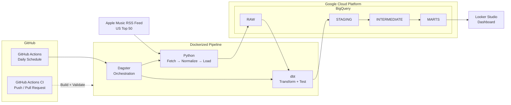

# Apple Music Analytics Pipeline

An end-to-end analytics engineering project that collects a daily snapshot of the **Apple Music US Top 50**, stores historical chart data in BigQuery, models rank movement with dbt, orchestrates the workflow with Dagster, and runs automatically through Docker and GitHub Actions.

The dataset is intentionally small — only **50 chart entries per daily snapshot**.

The goal was not to simulate "big data." I built this project to understand how the pieces of a modern data platform fit together from ingestion → warehouse → transformation → orchestration → automation → reporting.

> **The dataset is simple. The architecture was the project.**

---

## Architecture



### Pipeline at a Glance

```text
Apple Music RSS Feed
        ↓
Python ingestion
        ↓
BigQuery RAW
        ↓
dbt
        ↓
STAGING → INTERMEDIATE → MARTS
        ↓
Looker Studio
```

GitHub Actions starts the hosted pipeline each day.

Docker provides the runtime.

Dagster controls the order of execution.

Python handles ingestion.

BigQuery stores the data.

dbt transforms and tests it.

Looker Studio consumes the final analytics marts.

---

## Why I Built This

I love music, so I wanted my first personal data project to use a dataset I would actually enjoy working with.

The original question was simple:

> **How does the Apple Music Top 50 change from day to day?**

A single Top 50 list can tell me what is popular today.

It cannot tell me how the chart is changing.

By saving one snapshot every day, I can begin answering questions such as:

- Which tracks are moving up?
- Which tracks are falling?
- Which tracks entered the chart for the first time?
- Which tracks disappeared from the Top 50?
- Which tracks returned after previously dropping out?
- How long has a track remained on the chart?
- What is the best rank a track has reached?
- How much movement happened between daily snapshots?

The analytics themselves are intentionally straightforward.

The larger goal was learning how to build and connect an **end-to-end analytics system** rather than stopping at an API script or dashboard.

---

# Architecture & Tool Choices

I intentionally used a small dataset so I could focus on understanding **what each layer of a data platform is responsible for**.

Instead of putting the entire project inside one Python script, I separated ingestion, storage, transformation, testing, orchestration, execution, authentication, and reporting.

| Tool | Responsibility | Why I Used It |
|---|---|---|
| **Apple Music RSS Feed** | Data source | Provides a simple public source containing the current US Top 50 chart. |
| **Python** | Ingestion | Flexible for requesting the feed, validating the response, normalizing JSON, and loading rows into BigQuery. |
| **BigQuery** | Cloud data warehouse | Gives the project a managed SQL warehouse for both raw historical data and analytics-ready models without managing database infrastructure. |
| **dbt** | Transformation + testing | Keeps transformation logic in SQL and organizes the warehouse into RAW → STAGING → INTERMEDIATE → MARTS while also running data-quality tests. |
| **Dagster** | Orchestration | Defines dependencies between Python ingestion and dbt models so the pipeline executes in the correct order and can be viewed as one asset graph. |
| **Docker** | Runtime / packaging | Packages Python, Dagster, dbt, and their dependencies into one reproducible environment that can run locally or on GitHub's Linux runners. |
| **GitHub Actions** | CI + scheduled execution | Validates changes and provides a hosted machine that runs the pipeline every day without requiring my PC to remain online. |
| **GCP IAM** | Authorization | Controls what the automated pipeline is allowed to access inside Google Cloud. |
| **GCP Service Account** | Machine identity | Gives the pipeline its own identity rather than using my personal Google account. |
| **Workload Identity Federation** | Keyless authentication | Allows GitHub Actions to temporarily authenticate as the GCP service account without storing a permanent JSON credential. |
| **Looker Studio** | BI / reporting | Provides a lightweight reporting layer directly on top of the final BigQuery marts. |
| **Git / GitHub** | Version control | Tracks changes and supports feature branches, pull requests, and automated CI checks. |

---

## Where Google Cloud Fits

Google Cloud Platform currently provides the **warehouse and cloud identity layer** for the project.

```text
Google Cloud Platform
│
├── BigQuery
│   ├── RAW
│   ├── STAGING
│   ├── INTERMEDIATE
│   └── MARTS
│
└── IAM
    ├── Service Account
    └── Workload Identity Federation
```

The actual daily compute currently runs on a **GitHub-hosted runner**, not on a GCP server.

```text
GitHub Actions
      ↓
GitHub OIDC token
      ↓
GCP Workload Identity Federation
      ↓
GCP Service Account
      ↓
Docker
      ↓
Dagster
      ↓
BigQuery
```

This distinction was important to understand:

### Authentication

**Who is running the pipeline?**

```text
GitHub Actions
      ↓
OIDC
      ↓
Workload Identity Federation
      ↓
GCP Service Account
```

### Authorization

**What is that identity allowed to do?**

```text
GCP Service Account
      ↓
IAM Roles
      ↓
BigQuery Job User
BigQuery Data Editor
```

No permanent Google Cloud service-account key needs to be stored in the repository.

---

## Why Not Just Use One Python Script?

For 50 rows per day, I absolutely could.

A single scheduled Python script could fetch the chart, transform the data, and write the results somewhere.

That would be simpler.

But simplicity of the data source made this a useful environment for learning the architecture without also dealing with massive scale.

The purpose was to understand why larger systems separate responsibilities:

```text
Ingestion        → Python
Storage          → BigQuery
Transformation   → dbt
Testing          → dbt
Orchestration    → Dagster
Packaging        → Docker
CI               → GitHub Actions
Scheduling       → GitHub Actions
Cloud Identity   → GCP IAM / Workload Identity Federation
Visualization    → Looker Studio
```

The individual tools are not necessary because this dataset is large.

They are here because **learning how these responsibilities interact was the objective of the project**.

---

# What the Pipeline Does

Every day, the pipeline:

1. Fetches the current Apple Music US Top 50.
2. Saves the raw JSON response.
3. Normalizes the nested response into structured rows.
4. Checks whether the current Central Time reporting day already exists.
5. Loads a new snapshot into BigQuery when needed.
6. Runs the dbt transformation graph.
7. Runs dbt data-quality tests.
8. Rebuilds the final analytics marts.
9. Makes the updated data available to Looker Studio.

### Idempotent Daily Loads

The daily ingestion is designed to be **idempotent**.

If the pipeline accidentally executes multiple times on the same day:

```text
First run
   ↓
50 rows loaded

Second run
   ↓
Same reporting date detected
   ↓
0 duplicate rows loaded
```

This became especially useful while testing Docker, Dagster, and GitHub Actions because repeated test executions did not create additional daily snapshots.

---

# Data Modeling

BigQuery follows a layered analytics structure:

```text
RAW
 ↓
STAGING
 ↓
INTERMEDIATE
 ↓
MARTS
```

Each layer has a different responsibility.

---

## RAW

The raw layer preserves the historical chart observations loaded by Python.

Main source table:

```text
artist_momentum_raw.raw_apple_chart_entries
```

Each row represents one track observed during one daily Top 50 snapshot.

The raw layer stays close to the structure produced by ingestion.

---

## STAGING

```text
stg_apple_chart_entries
```

The staging layer cleans and standardizes raw chart data before downstream modeling.

This is where source data becomes consistent enough for analytics logic.

---

## INTERMEDIATE

```text
int_chart_snapshots
int_chart_rank_history
```

Intermediate models handle reusable business logic.

They establish the relationship between historical snapshots and determine how each track changed relative to previous observations.

Movement states include:

```text
baseline
first_observed
re_entry
moved_up
moved_down
unchanged
dropped
```

This layer separates more complicated ranking logic from the final reporting tables.

---

## MARTS

The final models are designed for analytics and reporting.

```text
fct_track_chart_history
mart_current_track_momentum
mart_chart_snapshot_summary
```

### `fct_track_chart_history`

Stores historical chart observations and movement information for individual tracks.

It provides the foundation for analyzing how songs behave across multiple snapshots.

### `mart_current_track_momentum`

Represents the latest state of tracks currently on the chart.

It includes information such as:

- current rank
- previous rank
- movement status
- best rank to date
- chart appearances
- latest snapshot indicators

This mart supports the **Current Top 50** dashboard.

### `mart_chart_snapshot_summary`

Summarizes movement across entire daily snapshots.

Examples include:

- tracks moving up
- tracks moving down
- unchanged tracks
- first observations
- re-entries
- dropped tracks
- current chart size

This mart supports higher-level trend analysis.

---

# Data Quality

The dbt project currently runs:

```text
6 models
52 tests
58 total dbt resources/tests
```

Tests validate assumptions such as:

- required values are not null
- historical keys are unique
- track identifiers are present
- snapshot fields are present
- movement statuses contain expected values
- final marts maintain expected uniqueness

The pipeline runs:

```text
dbt build
```

rather than simply creating the models.

That means transformations and their associated tests are executed together.

A successful pipeline requires the dbt build to complete successfully.

---

# Orchestration with Dagster

The project originally consisted of separate Python scripts and dbt models.

Dagster connects them into one dependency graph.

```text
fetch_apple_chart
        ↓
normalize_apple_chart
        ↓
load_apple_chart_bigquery
        ↓
stg_apple_chart_entries
        ↓
int_chart_snapshots
        ↓
int_chart_rank_history
        ↓
fct_track_chart_history
        ├── mart_current_track_momentum
        └── mart_chart_snapshot_summary
```

Dagster understands that dbt should not run before ingestion finishes.

That means the pipeline is no longer:

```text
Run script A
Remember to run script B
Remember to run script C
Remember to run dbt
```

Instead:

```text
Launch Dagster job
        ↓
Dagster resolves dependencies
        ↓
Complete pipeline executes
```

The Python ingestion assets and dbt models are also visible together in Dagster's asset lineage graph.

---

# Dockerized Execution

The full runtime is packaged inside Docker.

```text
Docker Container
│
├── Python
├── Dagster
├── dbt Core
├── dbt-bigquery
├── Google Cloud libraries
└── project code
```

Starting the container launches the complete Dagster asset job once:

```text
docker run
    ↓
Dagster
    ↓
full pipeline
    ↓
container exits
```

This means the project does not depend on the exact configuration of my Windows development environment.

The same image can execute on a Linux GitHub Actions runner.

### Reproducible dbt Manifest

Dagster uses dbt's `manifest.json` to understand the dbt project.

Instead of depending on a manifest generated on my laptop, the Docker image generates its own during the build.

```text
Fresh Git checkout
       ↓
Docker build
       ↓
dbt parse
       ↓
manifest.json
       ↓
Dagster definitions load
```

That helped make the container reproducible from a fresh repository checkout.

---

# Automation

The production pipeline runs through GitHub Actions every day at:

```text
2:30 AM America/Chicago
```

The hosted execution flow is:

```text
Scheduled GitHub Workflow
          ↓
GitHub-hosted Ubuntu Runner
          ↓
Build Docker Image
          ↓
Authenticate to GCP
          ↓
Run Docker Container
          ↓
Dagster
          ↓
Python Ingestion
          ↓
BigQuery
          ↓
dbt Build + Tests
```

Because GitHub provides the runner, my computer does **not** need to remain online.

The workflow can also be launched manually from GitHub Actions.

---

# Continuous Integration

The project has a separate CI workflow for code changes.

```text
Push / Pull Request
        ↓
GitHub Actions
        ↓
Fresh Repository Checkout
        ↓
Build Docker Image
        ↓
Generate dbt Manifest
        ↓
Load Dagster Definitions
        ↓
PASS / FAIL
```

This catches problems such as:

- broken Docker builds
- missing Python dependencies
- broken Dagster definitions
- dbt manifest problems
- environment-specific configuration issues

before changes are merged into `main`.

The project currently uses **CI + scheduled hosted execution**.

It does not yet deploy a persistent production service, so I do not describe the current workflow as full continuous deployment.

---

# Secure GCP Authentication

GitHub does not store a permanent GCP service-account JSON key.

Instead, the project uses:

```text
GitHub OIDC
      ↓
Google Workload Identity Federation
      ↓
GCP Service Account
      ↓
Short-Lived Credentials
      ↓
BigQuery
```

The Workload Identity Provider is restricted to this GitHub repository.

The service account is granted only the BigQuery capabilities needed by the pipeline:

```text
BigQuery Job User
BigQuery Data Editor
```

This lets an automated machine authenticate to Google Cloud without using my personal login or committing a long-lived private key.

---

# Dashboard

The final dbt marts connect directly to Looker Studio.

The dashboard currently focuses on three areas.

## Current Top 50

Shows the latest chart and current movement for each track.

Examples:

- current rank
- movement direction
- previous ranking behavior
- best rank
- number of chart appearances

## Snapshot Explorer

Allows an individual historical snapshot to be inspected.

This makes it easier to understand what changed on a specific day.

## Trends Over Time

Uses accumulated daily snapshots to show how the chart changes over time.

As more snapshots are collected, this page becomes more useful.

### Dashboard Screenshot

A dashboard screenshot can be stored in:

```text
docs/images/dashboard.png
```

and displayed here:

```markdown

```

---

# Repository Structure

```text
apple-music-analytics-pipeline/
│
├── .github/
│   └── workflows/
│       ├── daily-pipeline.yml
│       └── docker-ci.yml
│
├── dbt/
│   ├── models/
│   │   ├── staging/
│   │   ├── intermediate/
│   │   └── marts/
│   ├── dbt_project.yml
│   └── profiles.yml
│
├── orchestration/
│   ├── assets.py
│   ├── dbt_assets.py
│   ├── definitions.py
│   └── schedules.py
│
├── scripts/
│   ├── fetch_apple_charts.py
│   ├── normalize_apple_charts.py
│   └── load_apple_charts_to_bigquery.py
│
├── docs/
│   └── images/
│
├── .dockerignore
├── .gitignore
├── Dockerfile
├── pyproject.toml
├── requirements.txt
└── README.md
```

---

# Running Locally

## 1. Create a Virtual Environment

```powershell
python -m venv .venv
.\.venv\Scripts\Activate.ps1
```

## 2. Install Dependencies

```powershell
python -m pip install -r requirements.txt
```

## 3. Configure Google Cloud Authentication

Local development requires valid Google Cloud Application Default Credentials with access to the project's BigQuery datasets.

## 4. Configure Dagster

```powershell
$env:DAGSTER_HOME = "$PWD\.dagster"
$env:PYTHONLEGACYWINDOWSSTDIO = "1"
```

## 5. Start Dagster

```powershell
dg dev
```

Then open:

```text
http://localhost:3000
```

The production schedule is handled by GitHub Actions.

The local Dagster schedule therefore does not need to remain enabled.

---

# Current Limitations

This is intentionally a small portfolio project.

## Small Source Dataset

The Apple Music feed provides only the current Top 50.

Each daily snapshot therefore adds approximately:

```text
50 rows
```

This project does **not** demonstrate large-scale distributed data processing.

That was not the objective.

The small source allowed me to spend more time understanding system architecture rather than infrastructure scale.

---

## One Data Source

The current project uses only one public Apple Music feed.

That limits the number of questions the data can answer.

A future music project could combine:

- personal listening history
- song metadata
- artist metadata
- multiple chart sources
- recommendation data
- event or streaming data

---

## Batch Instead of Streaming

The chart only needs to be collected once per day.

Using Kafka, Pub/Sub, Spark Streaming, or another streaming system here would add complexity without solving an actual requirement.

For this dataset:

```text
Daily batch
```

is the appropriate architecture.

Streaming is something I would rather explore in a project where events actually arrive continuously.

---

# What I Learned

The most valuable part of this project was understanding that a data pipeline is more than moving rows from an API into a database.

I learned how different system responsibilities fit together:

```text
Data Source       → Apple Music RSS
Ingestion         → Python
Storage           → BigQuery
Transformation    → dbt
Testing           → dbt
Orchestration     → Dagster
Packaging         → Docker
CI                → GitHub Actions
Scheduling        → GitHub Actions
Cloud Identity    → GCP IAM
Authentication    → Workload Identity Federation
Visualization     → Looker Studio
```

More importantly, I learned **why those responsibilities are separated**.

I also learned how the boundaries between tools matter.

For example:

- GitHub Actions schedules and provides the hosted machine.
- Docker defines the environment that machine runs.
- Dagster orchestrates what happens inside that environment.
- Python handles ingestion.
- BigQuery persists the data.
- dbt owns analytical transformation logic.
- IAM controls cloud access.
- Looker Studio consumes analytics-ready outputs.

The individual pieces became much easier to understand once I saw how data and control moved between them.

> **The dataset is simple. The architecture was the project.**

---

# Future Improvements

Potential next steps include:

- continue collecting a longer chart history
- improve dashboard storytelling
- add additional music data sources
- add pipeline failure notifications
- add data freshness monitoring
- add stronger observability around pipeline runs
- publish the Docker image to a container registry
- deploy the image as a Cloud Run Job
- use Cloud Scheduler for GCP-native production scheduling
- expand GitHub Actions from CI into full CI/CD
- build a larger project around personal listening history
- experiment with event-driven or streaming ingestion when the source justifies it

A future GCP deployment could look like:

```text
Developer
    ↓
GitHub
    ↓
GitHub Actions
    ↓
Build + Test
    ↓
Artifact Registry
    ↓
Cloud Run Job
        ↑
Cloud Scheduler
        ↓
Dagster
        ↓
BigQuery
```

In that architecture:

```text
GitHub Actions = CI/CD
Cloud Scheduler = Production Schedule
Cloud Run Job = Production Compute
Docker = Deployable Runtime
Dagster = Pipeline Orchestration
```

The underlying Python, dbt, and Dagster pipeline could remain largely unchanged.

---

# Project Status

## Version 1 — Complete

The pipeline currently supports:

- automated daily Apple Music Top 50 ingestion
- raw JSON preservation
- normalized structured data
- duplicate-safe daily snapshots
- BigQuery warehouse storage
- layered RAW → STAGING → INTERMEDIATE → MARTS modeling
- historical rank movement calculations
- 52 dbt data-quality tests
- Dagster asset orchestration
- Dockerized execution
- GitHub Actions CI
- hosted daily pipeline execution
- GCP service-account authorization
- keyless Workload Identity Federation authentication
- Looker Studio reporting

The project will continue collecting daily snapshots so that the historical analysis becomes more useful over time.